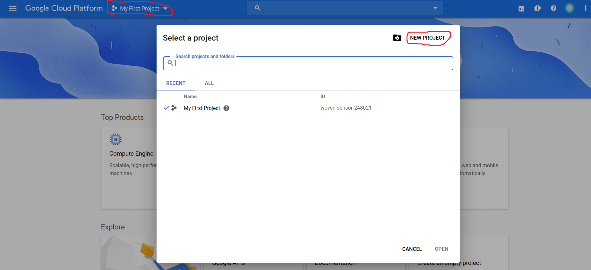

# MultiLang TTS

> Intelligent TTS Software

## NOTE: This software is currently in alpha testing

MultiLang TTS is a text-to-speech software that utilizes Google's WaveNet technology to create human-like speech [(read more about WaveNet)](https://arxiv.org/pdf/1609.03499.pdf). Unlike software currently using WaveNet, MultiLang TTS allows you to supply your own API key. This avoids having to pay a 3rd party for their software to access this technology.

## Getting Started

In order to use this software, the following is needed:

-   A Google Account
-   A payment method for Google's service (in the event that you plan to process over one million characters)
-   A Google Cloud Account

Procede with the instructions below to get started.

### Connecting to Google Cloud

_Steps last verified 7/2019_

1. First, navigate to Google Cloud's [homepage](https://cloud.google.com/text-to-speech/).
2. At the top right of the screen, make sure you are signed in with your gmail account. If you are, click, "try it free".
   
3. Select your country, accept the TOS, and click countinue.
4. Enter your customer info. Unfortunetly, billing info is needed in the event that you reach the one million character limit within a month (\$16.00 charge).
5. From the consoles homepage, select the current project in the top-left navbar. Then, in the popup, select, "new project".
   
6. Enter any name for the project ID and then hit "create".
7. Select the hotdog menu in the top right and navigate to _APIs & Services_ -> _Dashboard_. From the dashboard page, select "Enable APIs and Services".
   
8. In the search bar, search for, "cloud text-to-speech api". Select the option with the matching title
9. From the APIs page, click "enable".
10. Once redirected to the APIs homepage, select "credentials" on the left sidebar. Then, select _Create credentials_ -> _API key_.
    
11. In the pop-up window, copy the key shown and save it somewhere safe for once the software is installed. (If an unwanted person uses your API key, your monthly character count will increase and you could be charged).

## Installing

To install the software, navitage to this repository's [releases](https://github.com/NicolasNewman/MultiLang-TTS/releases) and download the desired version for your OS.

## Built With

-   [NodeJS](https://nodejs.org/en/) - The runtime environment
-   [Electron](https://electronjs.org/) - The GUI framework
-   [React](https://reactjs.org/) - The UI framework
-   [Webpack](https://webpack.js.org/) - The bundler

## Contributing

Please read [CONTRIBUTING.md](https://gist.github.com/PurpleBooth/b24679402957c63ec426) for details on our code of conduct, and the process for submitting pull requests to us.

## Authors

-   **Nicolas Newman** - _Creator_ - [NicolasNewman](https://github.com/NicolasNewman)

See also the list of [contributors](https://github.com/your/project/contributors) who participated in this project.

## License

This project is licensed under the MIT License - see the [LICENSE.md](LICENSE.md) file for details

## Release History

-   0.2.1
    -   CHANGE: Update docs (module code remains unchanged)
-   0.2.0
    -   CHANGE: Remove `setDefaultXYZ()`
    -   ADD: Add `init()`
-   0.1.1
    -   FIX: Crash when calling `baz()` (Thanks @GenerousContributorName!)
-   0.1.0
    -   The first proper release
    -   CHANGE: Rename `foo()` to `bar()`
-   0.0.1
    -   Work in progress
